# Diagrammes Mermaid - Architecture Flutter

## 1. Vue d'ensemble de l'Application

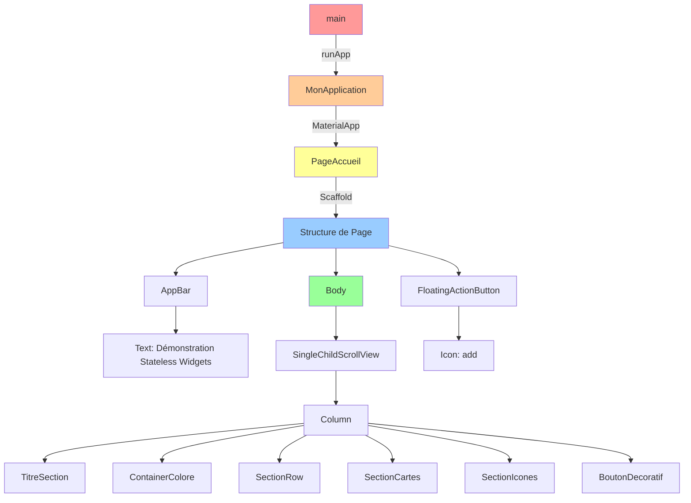

## 2. Hiérarchie Complète des Widgets

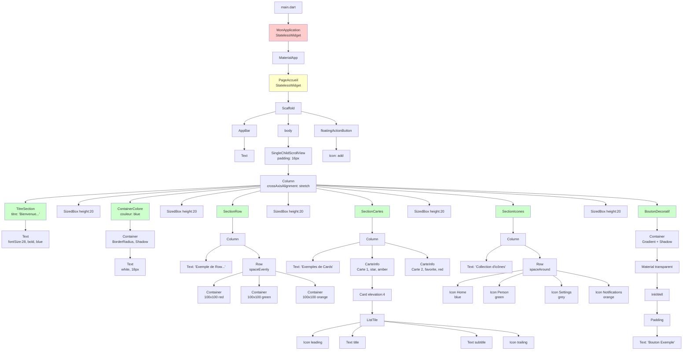

## 3. Disposition Layout - Column et Row

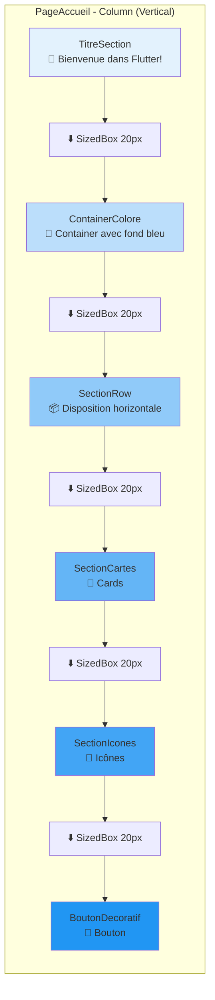

## 4. SectionRow - Disposition Horizontale

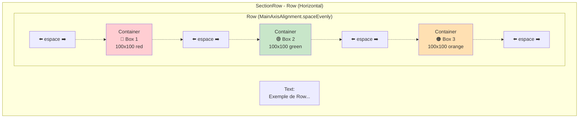

## 5. SectionCartes - Structure des Cards

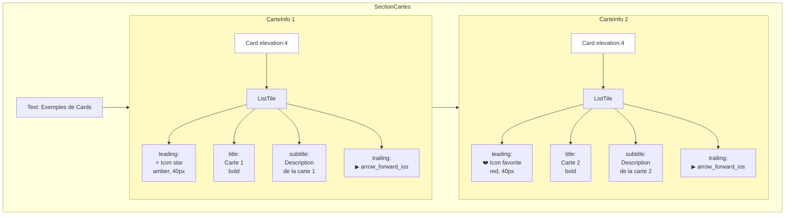

## 6. SectionIcones - Disposition des Icônes

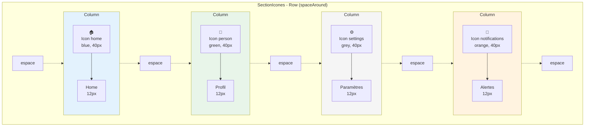

## 7. BoutonDecoratif - Architecture en Couches

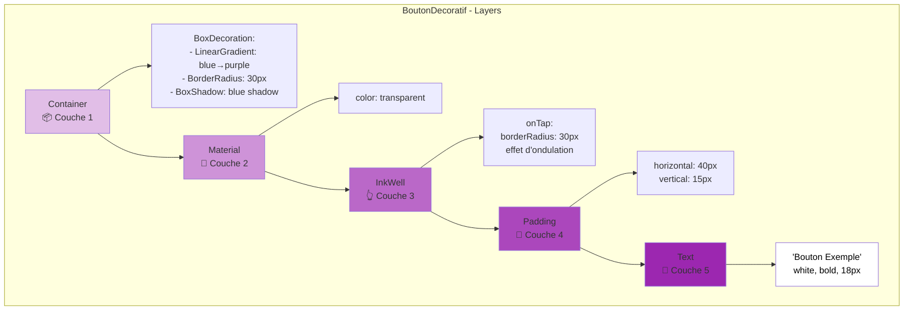

## 8. Flux de Construction des Widgets

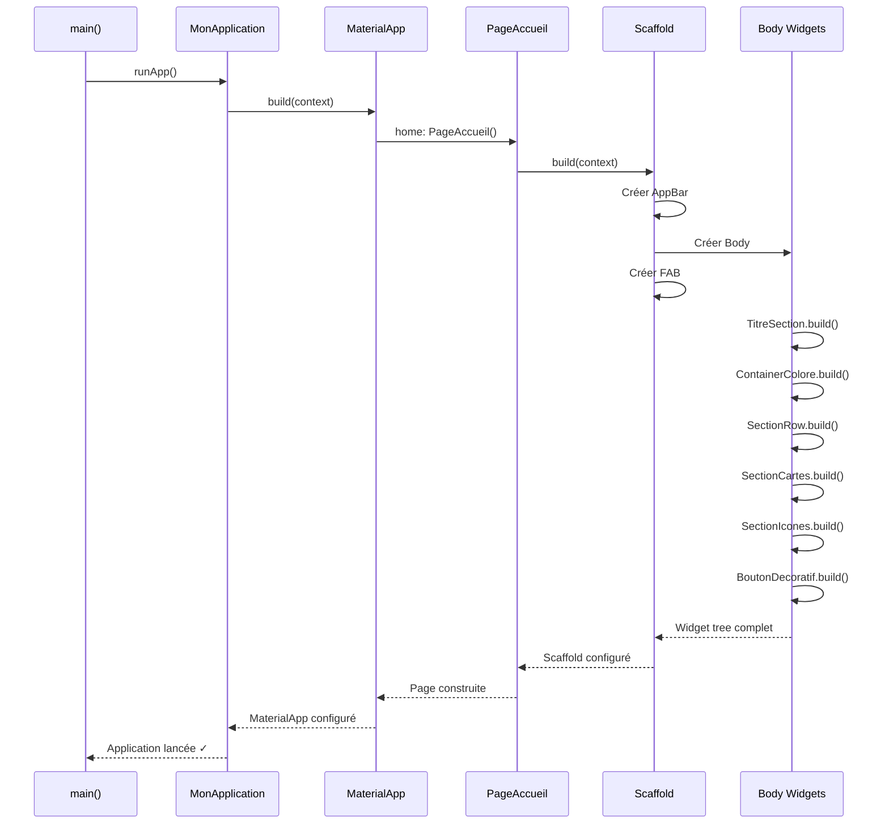

## 9. Types de Widgets Utilisés

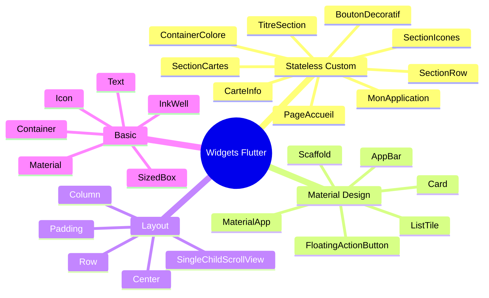

## 10. Paramètres et Props Flow

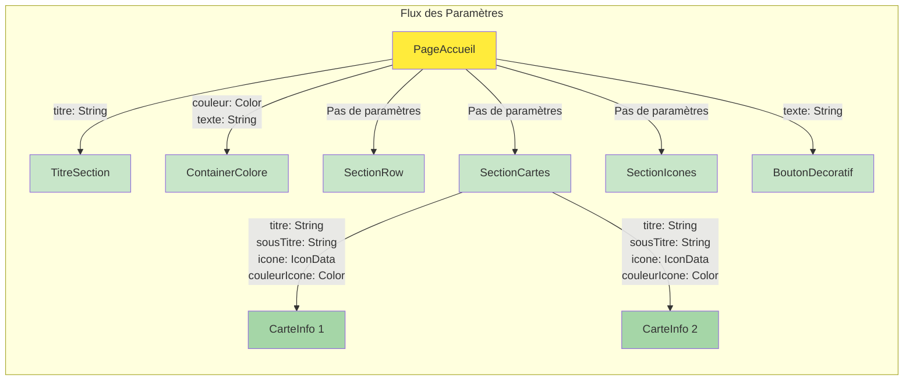

## 11. Cycle de Vie des Stateless Widgets

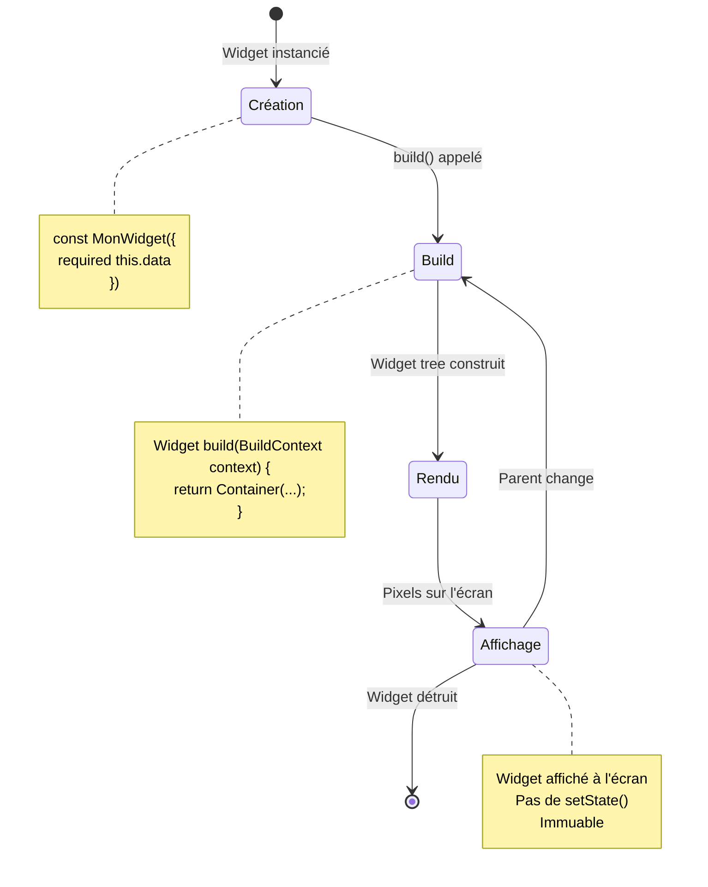

## 12. Architecture Visuelle de l'Écran

```mermaid
graph TB
    subgraph Screen["📱 Écran de l'Application"]
        subgraph AppBarZone["┏━━━━━━━━━━━━━━━━━━━━━━━━━━━━━━┓<br/>┃ Démonstration Stateless Widgets ┃<br/>┗━━━━━━━━━━━━━━━━━━━━━━━━━━━━━━┛"]
        end
        
        subgraph ScrollZone["Zone Défilante (SingleChildScrollView)"]
            Zone1["<br/>Bienvenue dans Flutter!<br/>(Titre 28px, bleu, centré)<br/>"]
            
            Zone2["┌─────────────────────────────┐<br/>│ Container avec fond bleu    │<br/>│  (BorderRadius, Shadow)     │<br/>└─────────────────────────────┘"]
            
            Zone3["Exemple de Row:<br/>┌─────┐  ┌─────┐  ┌─────┐<br/>│Box 1│  │Box 2│  │Box 3│<br/>│ 🔴  │  │ 🟢  │  │ 🟠  │<br/>└─────┘  └─────┘  └─────┘"]
            
            Zone4["Exemples de Cards:<br/>┌──────────────────────────┐<br/>│ ⭐ Carte 1          ▶    │<br/>│    Description...        │<br/>└──────────────────────────┘<br/>┌──────────────────────────┐<br/>│ ❤️  Carte 2          ▶    │<br/>│    Description...        │<br/>└──────────────────────────┘"]
            
            Zone5["Collection d'icônes:<br/>🏠    👤    ⚙️    🔔<br/>Home Profil Param Alertes"]
            
            Zone6["┌────────────────────────┐<br/>│   Bouton Exemple       │<br/>│ (Gradient blue→purple) │<br/>└────────────────────────┘"]
        end
        
        FABZone["                    ┌─────┐<br/>                    │  +  │<br/>                    └─────┘"]
        
        AppBarZone --> Zone1
        Zone1 --> Zone2
        Zone2 --> Zone3
        Zone3 --> Zone4
        Zone4 --> Zone5
        Zone5 --> Zone6
    end
    
    style AppBarZone fill:#2196f3,color:#fff
    style Zone1 fill:#e3f2fd
    style Zone2 fill:#bbdefb
    style Zone3 fill:#90caf9
    style Zone4 fill:#64b5f6
    style Zone5 fill:#42a5f5
    style Zone6 fill:#2196f3,color:#fff
    style FABZone fill:#ff9800,color:#fff
```

## 13. Comparaison Row vs Column

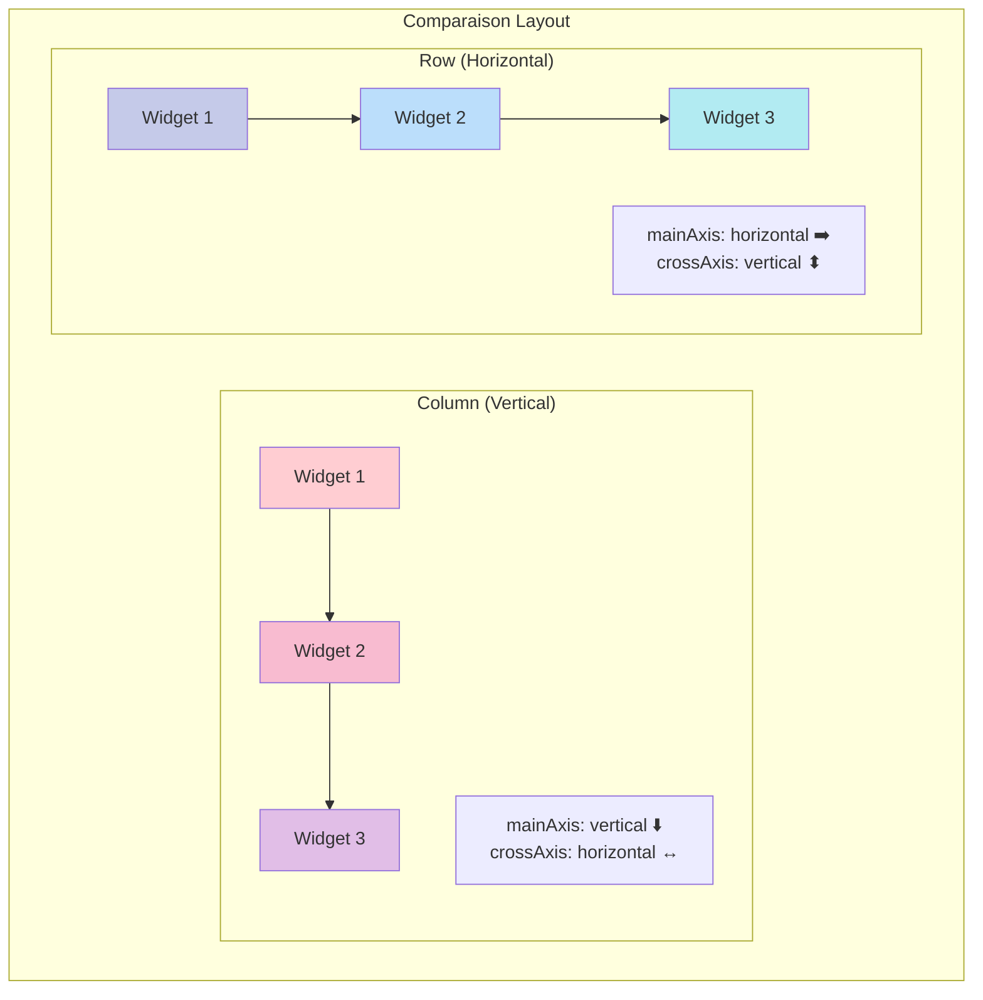

---

## Légende des Symboles

| Symbole | Signification |
|---------|--------------|
| 📱 | Application/Écran |
| 📦 | Container |
| 📝 | Text |
| 🎨 | Material/Style |
| 👆 | Interactive (InkWell) |
| 📏 | Padding/Spacing |
| ⬇️ | Direction verticale |
| ➡️ | Direction horizontale |
| 🔵 🔴 🟢 🟠 | Couleurs |
| ⭐ ❤️ 🏠 👤 ⚙️ 🔔 | Icônes |

---

## Comment Utiliser ces Diagrammes

1. **Pour comprendre la structure globale** : Voir diagrammes 1 et 2
2. **Pour comprendre les layouts** : Voir diagrammes 3, 4, 13
3. **Pour comprendre un widget spécifique** : Voir diagrammes 5, 6, 7
4. **Pour comprendre le flux de données** : Voir diagrammes 8, 10, 11
5. **Pour visualiser l'écran final** : Voir diagramme 12

Ces diagrammes peuvent être visualisés dans :
- GitHub (supporte Mermaid nativement)
- VS Code (avec extension Mermaid Preview)
- Sites web comme mermaid.live
- Documentation générée (GitBook, MkDocs, etc.)

